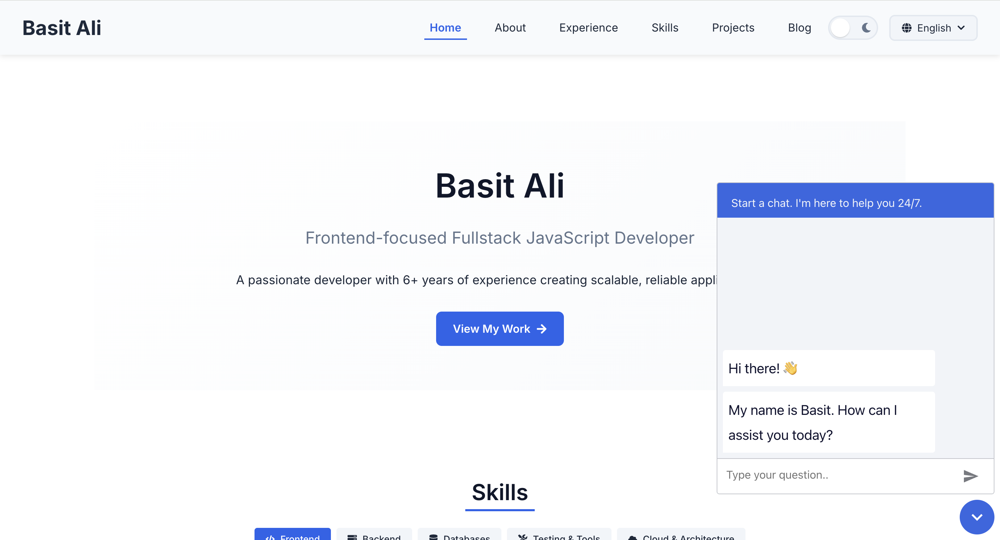

# Basit Ali - Portfolio Website

A modern, responsive portfolio website built with React, TypeScript, and Vite. Features include light/dark mode, multilingual support (English and German), and a technical blog focused on AI, LLMs, and modern web development.

[Link](https://basit-dev.de)


## 🌟 Features

- 💻 **Modern Stack**: Built with React 18, TypeScript, and Vite for fast development and performance
- 🎨 **Theme Switching**: Seamless light and dark mode with styled-components
- 🌐 **Multilingual**: Full support for English and German with i18next
- 📱 **Responsive Design**: Optimized for all screen sizes with mobile-friendly navigation
- 📝 **Technical Blog**: Featured articles on AI, LLMs, and modern web development
- 🧪 **Comprehensive Testing**: Unit tests with Jest and React Testing Library
- 🧩 **Modular Architecture**: Well-organized component structure for maintainability
- 🤖 **AI Integration**: Custom AI agent implementation showcasing practical AI applications

## 🤖 AI Projects

### Custom AI Agent in N8N

I've implemented a customized AI agent using N8N workflow automation platform, demonstrating my practical experience with artificial intelligence:

- **Custom Design Integration**: Implemented with full support for both light and dark themes to match different UI preferences
- **Multilingual Support**: Built with localization capabilities, supporting multiple languages for global users
- **Workflow Automation**: Created intelligent workflows that can process and respond to various triggers and data inputs
- **API Integration**: Connected the agent with various external services and APIs for enhanced functionality
- **Conversational Interface**: Designed natural language processing capabilities for intuitive human-computer interaction
- **Adaptive Logic**: Implemented decision-making logic that adjusts based on context and user inputs

This project showcases my ability to build practical AI solutions that integrate seamlessly with existing systems while maintaining excellent user experience across different languages and visual preferences.

## 🚀 Getting Started

### Prerequisites

- Node.js 16.x or higher
- npm or yarn

### Installation

1. Clone the repository:

```bash
git clone https://github.com/basitk41/portfolio.git
cd portfolio
```

2. Install dependencies:

```bash
npm install
# or with yarn
yarn install
```

3. Start the development server:

```bash
npm run dev
# or with yarn
yarn dev
```

The site will be available at `http://localhost:5173`

## 📂 Project Structure

```
basit-portfolio/
├── public/              # Static assets
│   ├── locales/         # Translation files for i18next
│   │   ├── en/          # English translations
│   │   └── de/          # German translations
│   └── images/          # Image assets
├── src/
│   ├── assets/          # Images and other assets
│   ├── components/      # React components
│   │   ├── layout/      # Layout components (Header, Footer, etc.)
│   │   ├── common/      # Reusable UI components
│   │   ├── home/        # Home page specific components
│   │   ├── about/       # About page specific components
│   │   ├── experience/  # Experience page specific components
│   │   ├── skills/      # Skills page specific components
│   │   ├── projects/    # Projects page specific components
│   │   └── blog/        # Blog page specific components
│   ├── context/         # React context providers
│   │   └── ThemeContext.tsx  # Theme context for light/dark mode
│   ├── data/            # Static data for the website
│   │   ├── experiences.ts    # Work experience data
│   │   ├── projects.ts       # Projects data
│   │   ├── skills.ts         # Skills data
│   │   └── blog-posts.ts     # Blog posts data
│   ├── hooks/           # Custom React hooks
│   │   └── useTheme.ts       # Hook for accessing theme context
│   ├── pages/           # Page components
│   │   ├── HomePage.tsx      # Home page
│   │   ├── AboutPage.tsx     # About page
│   │   ├── ExperiencePage.tsx # Experience page
│   │   ├── SkillsPage.tsx    # Skills page
│   │   ├── ProjectsPage.tsx  # Projects page
│   │   ├── BlogPage.tsx      # Blog listing page
│   │   └── BlogPostPage.tsx  # Individual blog post page
│   ├── routes/          # Routing configuration
│   │   └── AppRoutes.tsx     # Route definitions
│   ├── styles/          # Global styles
│   │   ├── global.css        # Global CSS
│   │   └── variables.css     # CSS variables for theming
│   ├── types/           # TypeScript type definitions
│   │   ├── experience.ts     # Experience type definitions
│   │   ├── project.ts        # Project type definitions
│   │   ├── skill.ts          # Skill type definitions
│   │   └── blog.ts           # Blog post type definitions
│   ├── utils/           # Utility functions
│   │   └── i18n.ts           # i18next configuration
│   ├── App.tsx          # Main App component
│   ├── main.tsx         # Entry point
│   └── vite-env.d.ts    # Vite type definitions
└── tests/               # Test files
```

## 📋 Available Scripts

- `npm run dev` - Start the development server
- `npm run build` - Build for production
- `npm run preview` - Preview the production build
- `npm run test` - Run tests
- `npm run test:coverage` - Run tests with coverage report
- `npm run lint` - Run ESLint

## 🛠️ Technologies Used

- **Framework**: [React](https://reactjs.org/)
- **Language**: [TypeScript](https://www.typescriptlang.org/)
- **Build Tool**: [Vite](https://vitejs.dev/)
- **Styling**: [Styled Components](https://styled-components.com/)
- **Routing**: [React Router](https://reactrouter.com/)
- **Internationalization**: [i18next](https://www.i18next.com/)
- **Testing**: [Jest](https://jestjs.io/), [React Testing Library](https://testing-library.com/docs/react-testing-library/intro/)
- **Icons**: [React Icons](https://react-icons.github.io/react-icons/)
- **Markdown Rendering**: [React Markdown](https://github.com/remarkjs/react-markdown)
- **AI Integration**: [N8N](https://n8n.io/) for workflow automation and AI agent implementation

## 🔧 Configuration

### Adding a New Language

1. Create a new translation file in `/public/locales/[language-code]/translation.json`
2. Add the language to the language options in `LanguageSelector.tsx`:

```typescript
const languages = [
  { code: "en", name: "English" },
  { code: "de", name: "Deutsch" },
  { code: "your-code", name: "Your Language" },
];
```

### Adding a New Blog Post

Add your blog post to the `blogPosts` array in `src/data/blog-posts.ts`:

```typescript
{
  id: 'unique-post-id',
  title: 'Your Blog Post Title',
  summary: 'A brief summary of your blog post',
  content: `
# Your Blog Post
This is the content of your blog post in markdown format.
  `,
  author: 'Your Name',
  date: '2025-01-01',
  readTime: 5,
  tags: ['Tag1', 'Tag2'],
  image: './images/blog/your-image.jpg',
  featured: true
}
```

## 📝 Blog Posts

The portfolio includes several technical blog posts focused on AI and modern web development:

1. **Leveraging AI in Modern Frontend Development** - How AI tools are transforming frontend development workflows
2. **Understanding Modern LLMs: A Developer's Guide** - A comprehensive overview of Large Language Models and their applications
3. **Micro Frontends: Scaling Your Frontend Architecture** - Exploring principles and strategies for micro frontend architecture
4. **How Generative AI Can Transform Your Daily Life** - Practical ways to use generative AI tools for productivity

## 🌙 Theme System

The portfolio features a complete dark/light mode system:

- Theme preferences are stored in localStorage
- System preference detection on first visit
- Smooth transitions between themes
- Comprehensive theming of all UI elements

## 🌐 Internationalization

Full support for multiple languages with:

- English and German translations included
- Easy addition of new languages
- Language selection persists between visits
- Automatic language detection based on browser settings

## 📱 Responsive Design

The portfolio is fully responsive across all device sizes:

- Mobile-first approach
- Responsive navigation with hamburger menu on mobile
- Optimized layouts for different screen sizes
- Touch-friendly interface elements

## 🧪 Testing

Comprehensive test suite using Jest and React Testing Library:

- Unit tests for components
- Context provider tests
- Utility function tests
- Mock implementations for external dependencies

## 🚀 Deployment

The portfolio is configured for easy deployment on platforms like Vercel, Netlify, or GitHub Pages:

### Deploying to Vercel

1. Push your repository to GitHub
2. Import the project in Vercel
3. Configure your deployment preferences
4. Deploy

### Deploying to Netlify

1. Push your repository to GitHub
2. Import the project in Netlify
3. Configure your deployment preferences
4. Deploy

## 📄 License

MIT License

## 📞 Contact

Basit Ali - [basitk41@gmail.com](mailto:basitk41@gmail.com)

Project Link: https://basit-dev.de
